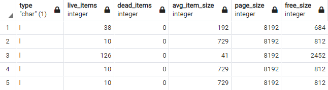
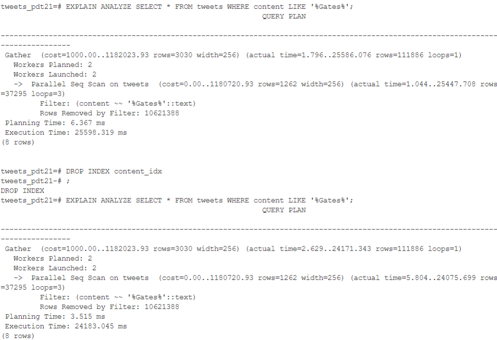

# PDT2021 Zadanie 2
## Oleksandr Lytvyn

1. V tomto selecte DBMS engine spravil vyhladavani pomocou sekvencneho skenu. Spravil to preto 
ze udaj v tabulke nie su rozsortovane + nie je implementovana ziadna metoda na jednoznacne porovnanie
doch prvkov

2. 1 worker pracoval na tomto selecte (1145ms). Pri zvacseni poctu workerov na 2 pomocou 
`max_parallel_workers_per_gather` a tym padom sa zrychlilo vykonavanie dopytu o 292 ms (858ms). Pri nalsedovnom zvacseni
poctu workerov cas dopytu sa vyrazne nemeni do 3 a 4 execution time sa znizoval - 801ms a 796ms. Pri dalsom zvaceni poctu 
workerov execution time zacal stupa 5-829,6 - 834. Pricinou toho je pocet jadier na PC, co je 4. Tak ze optimalnym poctom
workerov je 4.

3. Cas oproti pozidaviek bez index sa vyrazne zmenil (796ms -> 0.092ms). Pri zvaceni poctu na 4 workerov execution time sa 
zmensil na 0.043ms (planning time: 0.114). V tejto poziadavne planovac nepotrebuje zvacsenie poctu workrev (rychlost sa 
zvacsuje nevyrazne). Vytvorenie indexu sortuje data, a preto pomocou Btree algotirhmu vieme rychlos dostat vysledok.

4. Spravanie je rovnake ako v 1 ulohe (resp. Seq Scan). Preto ze sme vytvorili index iba na jeden stlpec('screen_name').
Index na stlpec folowers_count nemame :(, zatial

5. Najprv planovac prejede kazdy potrebny zaznam (ktory vyhovuje podmienke) a potom spravi recheck, 
aby overit spravnost operacie. Potom sa zobrazil pocet blockov ktore ktore boli navsteveni (visited) a nie su lossy.
Potom sa Vykona BitmapIndexScan a ked sa vyskytne index ktory vyhovuje podmienke hladania, sa najde heap address na 
ktory ukazuje index ako offset v bitmap a tento bit zmenime na 1. Recheck condition je tam preto ze pri BitmapHeapScan
bitmap riadkov pri velkych tabulkach sa nezmesti do pamate, a preto uklada bitmap blockov, a tym padom stava lossy.

6. Rozdiel je v tom ze v tomto dopyte sa vykonal iba skvencny sken tabulky. Pri selektovani vacsieho poctu riadko z 
tabulky planovac sa rozhodne rovno precita celu tabulky, co bude rychlejsie nez proces z minulej otazky.

7. Vytorenie indexov trvalo 2min12s, insert trval 56ms. Opakovane vytvorenie indexov trvalo 2min17s. Skusil som to
to spravit este raz, vysledky boli rovnake, vytvorenie + insert: 2min12sec a vytvorenie po dropnuti: 2min13sec. Trva 
to o 1 sekundu dlhsie kvoli to ze bol pridany jeden zaznam? 
8. Dlzka vytvorenia indexu pre retweet_count - 35s228ms, Dlzka vytvorenia indexu pre contex_idx - 5min27s
Rozdiel v case vytvarania indexov je sposobeny tym ze tweet_count su hodnoty int, a content je string 
(porovnovanie string je narocnejsie operacia nez porovnanie int) Dlzka vytvorenie indexu zalezi od typu, velkosti a poctu 
hodnot nad ktorymi vytvarame index
9. Tabulky pre porovnanie indexov v poradi: retweet_count, content, name, friends_count, description

Vsetky indexy maju rovnake magic, version, root - obashuje aktualnu 'root location', level -  uroven tree pre root stranku.
fastroot - current effective root, fastlevel - fast root level, najnizsi uroven jednej stranky.

Tabulka nizsie obsahuje informaciu o jednotlivych strankach v kazdom indexe v takom istom poradi ako aj v predoslej tabulke.
Vsetky hodnoty v stlpcoch pre kazdy index su rovnake, okrem stlpca live_items, page_size a free_size.
Teda 'content_idx' ma 38 zivych itemov a 'name_idx' - 126. Taktiez tieto indexy maju rozdiel v avg_ite_size stlpce,
'content_idx' ma 192 rozmer stranky, a 'name_idx' - 41. Nakoniec maju rozdiely aj v stlpci free_size,  'content_idx' - 684,
a 'name_idx' - 2452, a ostatne maju rovanku hodnotu - 812.

11. Prva query bola s indexom, druha - bez. Mozeme pozorovat ze pri query s indexom execution a planning time boli vacsie
nez pri query po zmazani indexu. Hoci v oboch pripadoch sa vykonava seq. scan, ale v pripade existencii indexu, planovac sa
snazi brat do uvahy index. Planovac ne pouzil Index Scan preto ze tento index pozaduje viacero IO operacii pre kazdy riadok
(vyhadat riadok v indexe, a vytiahnut riadok z heap), ted Seq scan vykona ib jedno citanie a uz bude vediet vysledok pre 
riadok.

12. Index sa nepouzil. Bol pouzity seq.scan. 

13. `CREATE INDEX content_idx_ops ON tweets (content text_pattern_ops);` pomocou tohto prikazu sme vytvorili 
btree index, ktory pouziva specialne urceny operation class.

 
Ale pri selecte s _Gates_, planovac  znovu pouzil sekvencny skan, co sposobene velkym poctom vratenych riadkov (111886).
A pri takomto pocte vratenych riadkov pozitije seq.scan viac optimalnym riesenim.

14. `CREATE INDEX content_idx_idiot ON tweets (content text_pattern_ops) WHERE content LIKE '%idiot #QAnon';` - vytvorime
index ktory najde tweet ktory konci na "idiot #QAnon". Pri selecte zobrazenom na brazku boli pouzite Bitmap Index 
Scan vyprodukuje bitmap lokacie potencialneho riadku, a posle bitmap do Bitmap HeapScan, ktory vyhlada samotny riadok pomocu
bitmap a vrati najviac vyhovujuce vysledky. Potom sa spravi Reacheck condition pre
dane riadok, aby overit spravnost vysledkov.

15. Najprv som vykonal query bez ziadnych indexov, ktora spravi iba sekvencny sken a rozsortuje hodnoty
`EXPLAIN SELECT * FROM accounts WHERE followers_count < 10 AND friends_count > 1000 ORDER BY statuses_count DESC`
potom som spravil index pre _followers_count_ : `CREATE INDEX followers_count_idx on accounts (followers_count);` 
ten isty select uz pouziva index, a rychlost sa zvacsila (1s198ms).

Potom som pridal index pre _friends_count_ : `CREATE INDEX friends_count_idx on accounts (friends_count);` 
Ten isty select z roznymi indexami mensimi indexami (1s178ms). Z explainu vidime ze Index friends_count_idx, obsahuje
bitmap na 1826k riadkov, a Potom sa uskutocni BitmapAND, co je redundantna operacia pri pocte takom pocte riadkov.
Teda overit kazdy zazname accountov najdenych v podla followers_count_idx ci ma friends_count > 1000, je viac optimalne
nez vyhladavat novy bitmap pre 1826k riadkov a potom este robit BitmapAnd. Tak ze vyrazne vykonnost sa neovlyvny, ale 
v tomto pripade este musime ukladovat aj index pre friends_count, co tiez zabera niejake miesto.
Robit index pre stlpec _statuses_count_ vobec nie je zmysel, preto ze pouziva sa iba na sortovanie.

15. Spravil som complex index pomocu nasledujucej query `CREATE INDEX friend_followers_idx on accounts (followers_count, friends_count);`
Query s predoslej ulohy prebiehla za 130ms, co je vyrazny narast rycholsti. Zvacsenie vykonyu sposobene tym ze uz mame bitmap pre
vsetky potrebne riadky, a teda iba musime vyhladat samotne riadky a overi ci naozaj vyhovuju poziadavke. Vytvorenim komplexneho indexu
sme eliminuvali potrebu BitmaAnd alebo filtrovanie, ako to bolo v predoslej ulohe

16. Query bola upravena nasledovne: `SELECT * FROM accounts WHERE followers_count < 1000 AND friends_count > 1000 ORDER BY statuses_count DESC`
A v tejto query planovac sa rozhodol vykonat seq. scan. Planovac spravil seq. scan preto ze vystup obsahoval vela riadkov (740655),
a v predoslom pripade to bolo  velmi malo riadkov (iba 719).

17. Btree index v tejto ulohe som vytvoril pomocou nasledujuceho prikazu 
`CREATE INDEX screen_name_char_idx ON accounts (screen_name varchar_pattern_ops);`
Pri vyhladavani presne _realDonaldTrump_ planovac pouzil vytvoreny btree index. 
Btree tento idex bol pouzity preto ze ked hladame pomocou operacie '=', znamena ze vieme cely string ktory hladame,
a informacie o kazdom string su ulozene v _screen_name_char_idx_. Cas vykonavania dopytu je 52-62ms.

Potom  som vytvoril gin index pomocou trigramov (trgm package na porovnovanie a zistovanie podobnosti dvoch textov). 
`CREATE INDEX screen_name_trgm_idx ON accounts USING GIN (screen_name gin_trgm_ops);`
Pri hladani pomocou 'LIKE' planovac pouzije vytvoreny index _screen_name_trgm_idx_ (ked ze pred vytvorenim GIN indexu
pouzival seq. scan). Planovac pouzit tento gin index preto ze on je specialne urceny na vyhladavanie pomocou operacie 
'LIKE' a ~. Cas vykonavania dopytu je 56-63ms.

18. V tejto quey som na zaciatku spravil GIN index pre tweets.content a spolocny GIN index pre stlpce accounts.name a 
accounts.description.

`CREATE INDEX content_gin_idx ON tweets USING GIN (to_tsvector('english', content))`

`CREATE INDEX description_name_accs_idx ON accounts USING GIN (to_tsvector('english', name || ' ' || description))`
Potom som spravil nasledujuc query:

`SELECT * FROM tweets 
FULL OUTER JOIN accounts ON tweets.author_id=accounts.id
WHERE to_tsvector('english', tweets.content) @@ to_tsquery('John | Oliver')
AND to_tsvector('english', accounts.name || ' ' || accounts.description) @@ to_tsquery('John | Oliver')
ORDER BY tweets.retweet_count DESC`

V na zaciku tato query vyzerala uplne inac, bolo to dva selecty spojene cez UNION ALL, to sice fungovalo, ale potreboval
som vysledky v indej podobe (mergovalo to vsetky stlpce za sebou, potreboval som dat vsetko do jedneho riadku tweet - author_account).
Tak ze spravil som to cez OR a teda bezalo to dlhsi cas, a tak som sa nedockal. Potom sa rozhodol 
tuto query optimalizovat, precital som este raz zadanie pozornejsie, a teda rozhodol sa robit cez JOIN a 
AND operatory. Operator OR je dost narocna operacia, preto ze planovac potrebuje spracovat jednotlive 
casti statementu nezavisle. OR teoreticky by som vediel pouzit, ked vykonavali operaciu na jednej tabulke, ale 
to nie nas pripad. Operacia nad viaceremi tabulkamy vyzaduje ovela viac casu a pamate na vypocet.

