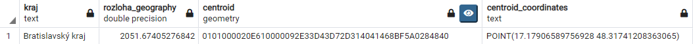

# PDT2021 Zadanie 3
## Oleksandr Lytvyn


git: [https://github.com/letv3/adt_project1/blob/main/task3/task3_lytvyn.md](git)
v tomto adresare sa nachadza aj subor s sql dopytami

**2.** Pomocou tochto prikazu som zistil ake su kraje na Slovensku a vypisal teda ich suradnice

```sql
SELECT t.name as Kraj , st_astext(st_setsrid(t.way, 4326)::geography) as Suradnice 
    FROM planet_osm_polygon t 
    WHERE admin_level = '4'
```
    


   

**3.** V tejto ulohe som mal vypocitat areu kazdeho okresu a zobrazit v km^2 v SRID 4326. Tym ze st_area
v pripade geography objekto vrati plochu v m^2 mal previest na km^2 (vydelit 1000^2). V pripade ze st_area
ma iba geometry objekty tak ono vrati v specifickych jednotkach.
   ```sql
   SELECT t.name as Kraj, 
       t.way_area as Rozloha,
       st_area(t.way) as Rozloha_geometry,
       st_area(st_transform(t.way, 4326)::geography, true)/1000000 as Rozloha_geography
   FROM planet_osm_polygon t 
   WHERE admin_level = '4' ORDER BY Rozloha_geography DESC
   ```
   

**4.** V tejto ulohe som mal pridat dom, kde byvam ako polygon (ked ze momentalne byvam na intraku tak pridal
som ho LOL) 
   ```sql
   INSERT INTO planet_osm_polygon(osm_id, "addr:housenumber", building, way)
   VALUES (9999999999, 53, 'mladost', (st_geomfromtext('POLYGON((17.0631661 48.1595083, 17.0633672 48.1590413, ' ||
                                                       '17.0634719 48.159061, 17.0635362 48.1588982, ' ||
                                                       '17.0636194 48.1589161, 17.0636703 48.1587801, ' ||
                                                       '17.0644535 48.1589179, 17.0643972 48.1590574, ' ||
                                                       '17.0644723 48.1590718, 17.064416 48.1592578, ' ||
                                                       '17.0643194 48.1592489, 17.0642631 48.1593956, ' ||
                                                       '17.064188 48.1593884, 17.0641317 48.1595405, ' ||
                                                       '17.0640378 48.159528, 17.0639788 48.1596765, ' ||
                                                       '17.0631661 48.1595083))', 3857)));
   SELECT st_setsrid(t.way, 4326) FROM planet_osm_polygon t WHERE building = 'mladost';
   ```
   
**5.** V tejto ulohe som mal zistit v ako kraje je moj dom a spravil to pomocou dalsieho selectu
   ```sql
   SELECT t.name
   FROM planet_osm_polygon t
   WHERE t.admin_level = '4'  
   AND st_contains(st_transform(t.way, 4326), 
                  (SELECT st_setsrid(tb.way, 4326) FROM planet_osm_polygon tb WHERE tb.building = 'mladost'))
   ```
   
**6.** V tejto ulohe som mal pridat svoju aktualnu polohu, a zobrazit vysledok na mape. Koordinaty polohy son
zistil pomocou GMAPS
   ```sql
   INSERT INTO planet_osm_point(osm_id, name, way)
   VALUES (0000000000, 'actual_position', st_makepoint(17.1258558, 48.1433749));
   SELECT st_setsrid(way, 4326) FROM planet_osm_point WHERE name = 'actual_position';
   ```
   
   

**7.** Zistite ci ste doma. Aby overit pre istotu som aj spravil iny point, kde by som bol doma, 
ale to sem nedal (je to selectoch), a je to spravne.
   ```sql
   SELECT st_contains(
        (SELECT st_setsrid(tb.way, 4326) FROM planet_osm_polygon tb WHERE tb.building = 'mladost'), 
        (SELECT st_setsrid(way, 4326) FROM planet_osm_point WHERE name = 'actual_position')
   ) as som_doma;
   ```

   

**8.** Zistit ako daleko som od nasej **alma mater**
   ```sql
   SELECT st_distance(
        (SELECT st_transform(way, 4326) FROM planet_osm_polygon WHERE name = 'Fakulta informatiky a informačných technológií STU')::geography,
        (SELECT st_setsrid(way, 4326) FROM planet_osm_point WHERE name = 'actual_position')::geography
   );
   ```
   
   

Skutocna vzdialenost v GMAPS, je to trochu viac kvoli ludskemu faktoru (mne)

   

**9.** Vyplotovat kraje a moj dom v QGIS. Spravil som tabulku "okresy_a_dom", potom ju importnul do QGIS a zobrazil.
   ```sql
   INSERT INTO okresy_a_dom (osm_id, name, way)
   SELECT t.osm_id, t.name ,st_transform(t.way, 4326) FROM planet_osm_polygon t WHERE admin_level = '4'
   UNION ALL
   SELECT t.osm_id, t.building ,st_setsrid(t.way, 4326) FROM planet_osm_polygon t WHERE t.building = 'mladost'
   ```
   
    
    

**10.** Zistite centroidu najmensieho okresu. EPSG:4326
   ```sql
   SELECT t.name as Kraj,
	   st_area(st_transform(t.way, 4326)::geography, true)/1000000 as Rozloha_geography,
	   ST_Centroid(st_transform(t.way, 4326)) as centroid,
	   st_astext(ST_Centroid(st_transform(t.way, 4326))) as centroid_coordinates
    FROM planet_osm_polygon t 
    WHERE admin_level = '4' ORDER BY Rozloha_geography ASC LIMIT 1
   ```

   

**11.** Vytvorit priestorovu tabulku vsetkych usekove ciest, ktorych vzdielenost od vzjomnej hranice 
okresov Malacky a Pezinok je > 10km
   ```sql
   INSERT INTO nearest_roads (osm_id, distance_from_centroid, road)
   SELECT * FROM (
       SELECT  r.osm_id, 
       st_distance(
           st_transform(r.way, 4326)::geography, 
           (SELECT st_intersection(
               (SELECT st_transform(way, 4326) 
                FROM planet_osm_polygon t 
                WHERE (name LIKE '%Malack%') and admin_level = '8' ),
               (SELECT st_transform(way, 4326) 
                FROM planet_osm_polygon t 
                WHERE (name LIKE '%Pezinok%') and admin_level = '8'))::geography
       ))/1000 as distance,
       st_transform(r.way, 4326)
       FROM planet_osm_roads r
   ) as t WHERE distance < 10; 
   ```
   A vyplotuje nieco take :)

   

**12.** V tejto ulohe mal som najst meno a cislo katastralneho uzemia kde sa nachadza najdlhsi odsek cesty
v okrese kde byvam. V tejto ulohe som na zaciatku spravil pre vsetky cesty (aj chodniki, aj zeleznice) a 
potom som odfiltroval iba pre highway alebo motorcar.
   ```sql
   INSERT INTO ku_with_longest_road_highway_motorcar (
	id, name, geom
   )
   SELECT idn5, nm5, st_transform(geom, 4326) FROM ku_0 
   WHERE st_intersects(st_transform(geom, 4326),
                          (-- select longest road in the okres where I live
                           SELECT st_transform(r.way, 4326) as road
                           FROM planet_osm_roads r 
                           WHERE st_within(st_transform(r.way, 4326),
                                           -- select okres where I live
                                           (SELECT st_transform(t.way, 4326) FROM planet_osm_polygon t
                                            WHERE admin_level = '8' 
                                            AND st_contains (st_transform(t.way, 4326),
                                                            (SELECT st_setsrid(way, 4326) FROM planet_osm_point WHERE name = 'home_position'))
                                           )
                                          )
                           AND highway IS NOT Null or motorcar IS NOT Null --filtroanie cies kde mozu jazdit auta 
                           ORDER BY st_length(st_transform(r.way, 4326)::geography) DESC
                           LIMIT 1)
                      )
   ```
   V prvom pripade som dostal dalsi vysledok (to je asi chodnik, ale neviem a preto tu davam)

   

   A nachadza tento chodnik v dalsich katastralnych uzemiach

   

   V druhom pripade (po vyfylstrovani podla highway a motorcar) dostal som tuto cestu 
   (usek D4 v Zahorskej Bystrici)

   

   A teda nachadza sa tato cesta v nasledujucom katastralnom uzemi

   
   

**13.** V tejto ulohe som mal vytvorit polygon okolo 20km vzdialenost od Bratislavy a najt jeho vymeru,
pri tom ten polygon mal byt iba na uzmei Sloveska.
   ```sql
   SELECT st_difference(
        (SELECT st_intersection(
            (SELECT  st_transform(t.way, 4326) 
             FROM planet_osm_polygon t 
             WHERE admin_level = '2'),
            (st_buffer((SELECT st_transform(t.way, 4326)::geography 
                        FROM planet_osm_polygon t
                        WHERE name LIKE 'Bratislava%' and admin_level = '6'), 20*1000)::geometry)
            )
        ), 
        (SELECT st_transform(t.way, 4326) 
         FROM planet_osm_polygon t
         WHERE name LIKE 'Bratislava%' and admin_level = '6'))
   ```

   Vyzera tento polygon takto:

   

   a ma plochu: 1480.121 km^2

PS: Pekne a Zajumave zadanie, zase. Uz sa tesim na buduce :)
   
      
