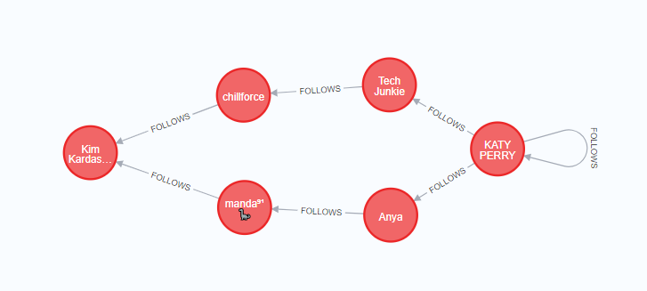
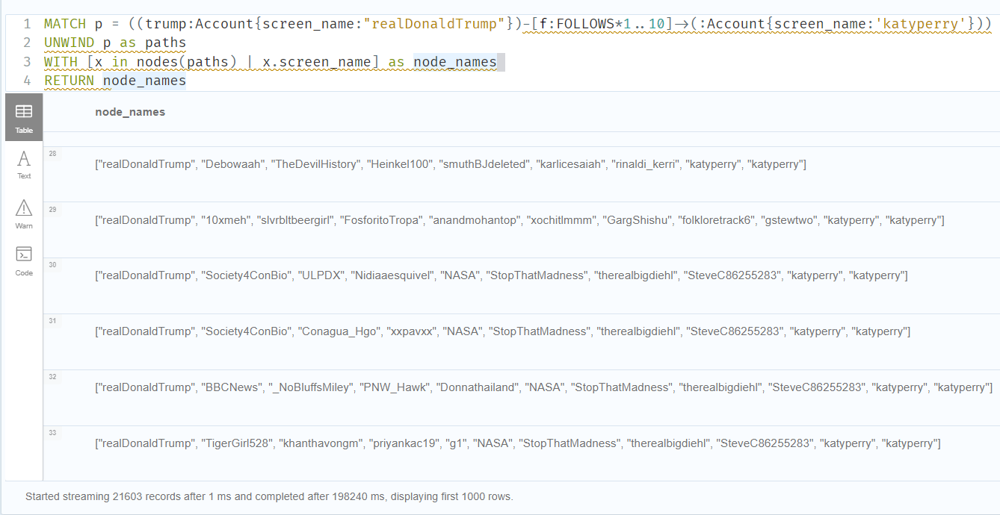
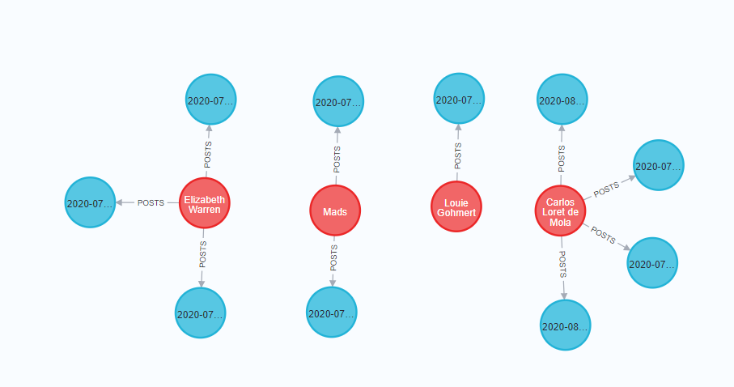
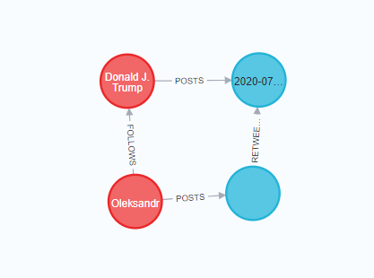
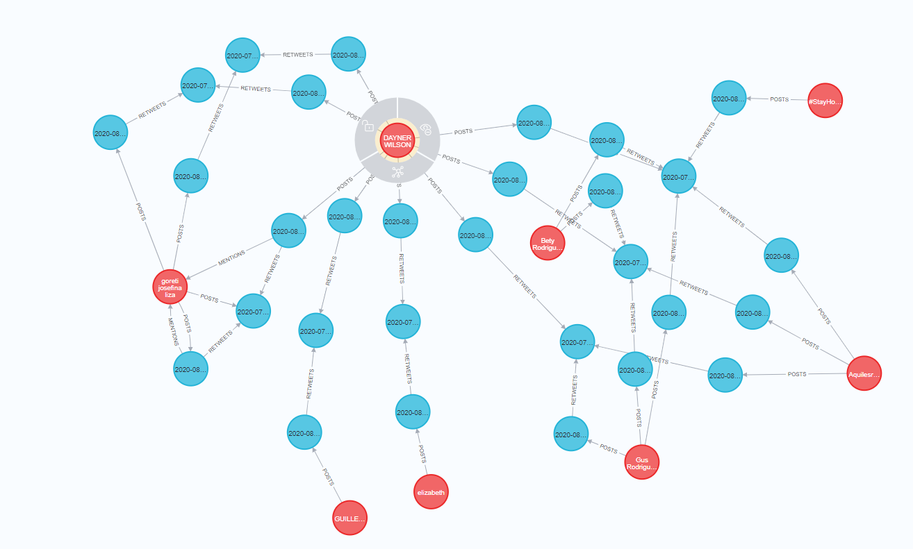
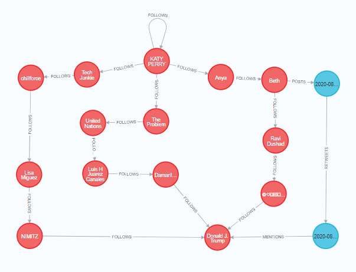
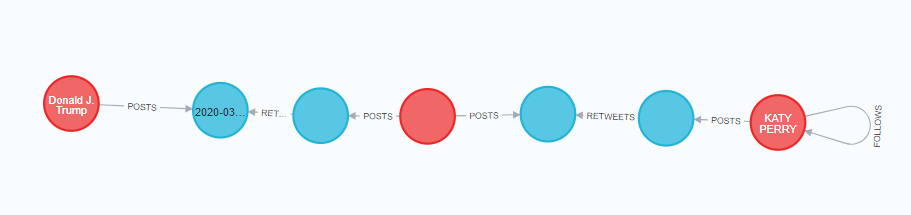

# PDT2021 Zadanie 6 - Neo4J
## Oleksandr Lytvyn

git: https://github.com/letv3/adt_project1/blob/main/task6

0. Spustanie Neo4J v docker. docker-compos.yaml 
```
version: '3'
services:
  neo4j:
    image: neo4j:4.4.2-community
    container_name: "graph-db"
#    restart: unless-stopped
    ports:
      - 7474:7474
      - 7687:7687
    volumes:
      - d:/neo4jdata/conf:/conf
      - d:/neo4jdata/data:/data
      - d:/neo4jdata/import:/import
      - d:/neo4jdata/logs:/logs
      - d:/neo4jdata/plugins:/plugins
    environment:
      # Raise memory limits
      - NEO4J_dbms_memory_pagecache_size=1G
      - NEO4J_dbms.memory.heap.initial_size=1G
      - NEO4J_dbms_memory_heap_max__size=1G
```

1. Importovanie dumpu
```commandline
docker compose up -d
docker cp /data:tweets2021_440.dump 
docker exec -it graph-db bash
neo4j-admin load --database=neo4j --from=/data/tweets2021_440.dump --force
```
a po zadani prikazov je potrebne restartnut container.

2. Vypíšte 5 Accountov s najvyšším množstvom followerov.
```
MATCH (a:Account)<-[f:FOLLOWS]-(b:Account) RETURN a,count(f) ORDER BY count(f) DESC LIMIT 5
```
RESULT:
```
╒══════════════════════════════════════════════════════════════════════════════════════════════════════════════════════════════╤══════════╕
│"a"                                                                                                                           │"count(f)"│
╞══════════════════════════════════════════════════════════════════════════════════════════════════════════════════════════════╪══════════╡
│{"friends_count":601062,"screen_name":"BarackObama","statuses_count":15926,"followers_count":122702797,"name":"Barack Obama","│12725     │
│description":"Dad, husband, President, citizen.","id":"813286"}                                                               │          │
├──────────────────────────────────────────────────────────────────────────────────────────────────────────────────────────────┼──────────┤
│{"friends_count":224,"screen_name":"katyperry","statuses_count":10881,"followers_count":108521347,"name":"KATY PERRY","descrip│11461     │
│tion":"Love. Light.","id":"21447363"}                                                                                         │          │
├──────────────────────────────────────────────────────────────────────────────────────────────────────────────────────────────┼──────────┤
│{"friends_count":50,"screen_name":"realDonaldTrump","statuses_count":56081,"followers_count":86091475,"name":"Donald J. Trump"│6720      │
│,"description":"45th President of the United States of America🇺🇸","id":"25073877"}                                            │          │
├──────────────────────────────────────────────────────────────────────────────────────────────────────────────────────────────┼──────────┤
│{"friends_count":127,"screen_name":"KimKardashian","statuses_count":33006,"followers_count":66740871,"name":"Kim Kardashian We│6680      │
│st","description":"Shop @kkwfragrance Diamonds II by Kourtney x Kim x Khloé now  & @SKIMS Sleep Naked Tuesday, 09.22 at 9AM PT│          │
│","id":"25365536"}                                                                                                            │          │
├──────────────────────────────────────────────────────────────────────────────────────────────────────────────────────────────┼──────────┤
│{"friends_count":2355,"screen_name":"narendramodi","statuses_count":27625,"followers_count":62440782,"name":"Narendra Modi","d│6425      │
│escription":"Prime Minister of India","id":"18839785"}                                                                        │          │
└──────────────────────────────────────────────────────────────────────────────────────────────────────────────────────────────┴──────────┘

```

3. Nájdite najkratšie cesty medzi Katy Perry {screen_name: ‘katyperry‘} a Kim Kardashian
{screen_name: ‘KimKardashian‘} cez vzťah FOLLOWS.
```
MATCH (start:Account{screen_name: 'katyperry'}),
      (end:Account{screen_name: 'KimKardashian'}),
      p = allShortestPaths((start)-[f:FOLLOWS*]->(end))
UNWIND p as paths
WITH [x in nodes(paths) | x.screen_name] as node_names
RETURN node_names
```
RESULT:
```
╒═════════════════════════════════════════════════════════╕
│"node_names"                                             │
╞═════════════════════════════════════════════════════════╡
│["katyperry","techjunkiejh","chillforce","KimKardashian"]│
├─────────────────────────────────────────────────────────┤
│["katyperry","anya4yoga","dreaminoflwt","KimKardashian"] │
└─────────────────────────────────────────────────────────┘
```


Všetky cesty, kde Donald Trump followuje niekoho, kto followuje niekoho, kto..., kto followuje Katy Perry.
 
```
MATCH p = ((trump:Account{screen_name:"realDonaldTrump"})-
            [f:FOLLOWS*1..]->
            (acc:Account)-
            [:FOLLOWS]->
            (:Account{screen_name:'katyperry'}))
RETURN p
```
Tak to formulovana query bezi dlho, tak preto som sa rozhodol ju preformulovat aby dostat viac-menej normalne vysledky.
Konkretne som pridal obmedzenie hlbky prehladavania na 10.
```
MATCH p = ((trump:Account{screen_name:"realDonaldTrump"})-
            [f:FOLLOWS*1..10]->
            (acc:Account)-
            [:FOLLOWS]->
            (:Account{screen_name:'katyperry'}))
UNWIND p as paths
WITH [x in nodes(paths) | x.screen_name] as node_names
RETURN node_names

```
RESULT:


4. Vyhľadajte neúspešné tweety influencerov. Vyhľadajte 10 najmenej retweetovanych tweetov
   od Accountov, ktoré sú na prvých 10 miestach v celkovom počte retweetov.

```
MATCH (acc:Account)-[:POSTS]->(:Tweet)<-[most_ret:RETWEETS]-(:Tweet)
WITH acc as influencers, 
        count(most_ret) as retweet_count
        ORDER BY retweet_count DESC LIMIT 10
UNWIND influencers as influencer
MATCH (influencer)-[:POSTS]->(less_popular_tweets:Tweet)<-[less_ret:RETWEETS]-(:Tweet)
WITH influencer, less_popular_tweets, count(less_ret) as less_retweets
        ORDER BY less_retweets ASC LIMIT 10
RETURN  influencer.screen_name, 
        influencer.id,
        less_popular_tweets.author_id,
        less_popular_tweets.content,
        less_retweets
```

```
╒════════════════════════╤═══════════════╤═══════════════════════════════╤══════════════════════════════════════════════════════════════════════╤═══════════════╕
│"influencer.screen_name"│"influencer.id"│"less_popular_tweets.author_id"│"less_popular_tweets.content"                                         │"less_retweets"│
╞════════════════════════╪═══════════════╪═══════════════════════════════╪══════════════════════════════════════════════════════════════════════╪═══════════════╡
│"ewarren"               │"357606935"    │"357606935"                    │"Last night, the federal evictions moratorium expired, and rent is due│1              │
│                        │               │                               │ next week—the same week coronavirus unemployment benefits are set to │               │
│                        │               │                               │end.\n
This is a completely preventable crisis. Congress must act imme│               │
│                        │               │                               │diately to extend these critical protections.

https://t.co/9gALMcbR3k│               │
│                        │               │                               │"                                                                     │               │
├────────────────────────┼───────────────┼───────────────────────────────┼──────────────────────────────────────────────────────────────────────┼───────────────┤
│"CarlosLoret"           │"68844197"     │"68844197"                     │"Este estudio en el @washingtonpost dice que para reabrir las universi│2              │
│                        │               │                               │dades habría que hacer una prueba de Covid cada dos días a los alumnos│               │
│                        │               │                               │ https://t.co/69T4wIguXG"                                             │               │
├────────────────────────┼───────────────┼───────────────────────────────┼──────────────────────────────────────────────────────────────────────┼───────────────┤
│"replouiegohmert"       │"22055226"     │"22055226"                     │"Lots of #FakeNews going around about this https://t.co/OQhHYZJZvh"   │3              │
├────────────────────────┼───────────────┼───────────────────────────────┼──────────────────────────────────────────────────────────────────────┼───────────────┤
│"ewarren"               │"357606935"    │"357606935"                    │"We know what we need to do to contain the virus and save lives and ou│3              │
│                        │               │                               │r economy—but Republicans refuse to invest enough in widespread testin│               │
│                        │               │                               │g and contact tracing.\n
Trump and his Republican buddies don’t have w│               │
│                        │               │                               │hat it takes to get us out of this crisis.
https://t.co/1CDbH26bmu"   │               │
├────────────────────────┼───────────────┼───────────────────────────────┼──────────────────────────────────────────────────────────────────────┼───────────────┤
│"CarlosLoret"           │"68844197"     │"68844197"                     │"Para morirse de envidia: cómo Francia está viviendo su nueva normalid│6              │
│                        │               │                               │ad. Este articulista sale a restaurantes, va a conciertos y a centros │               │
│                        │               │                               │comerciales. El truco: pruebas y rastreo de contactos. https://t.co/Xc│               │
│                        │               │                               │VG6T7E0P"                                                             │               │
├────────────────────────┼───────────────┼───────────────────────────────┼──────────────────────────────────────────────────────────────────────┼───────────────┤
│"ewarren"               │"357606935"    │"357606935"                    │"We need to make sure schools have all the resources they need to dete│10             │
│                        │               │                               │rmine whether and how to safely reopen. Anything less is recklessly en│               │
│                        │               │                               │dangering lives for political gain. \nhttps://t.co/XVwGQ7yRF4"        │               │
├────────────────────────┼───────────────┼───────────────────────────────┼──────────────────────────────────────────────────────────────────────┼───────────────┤
│"CarlosLoret"           │"68844197"     │"68844197"                     │"688 fallecimientos documentados en 24 horas, ya son 46 mil 688 deceso│12             │
│                        │               │                               │s por #Covid en #México. https://t.co/gh6x8hYCt2"                     │               │
├────────────────────────┼───────────────┼───────────────────────────────┼──────────────────────────────────────────────────────────────────────┼───────────────┤
│"CarlosLoret"           │"68844197"     │"68844197"                     │"Murió Paco Valverde, un gran luchador por la naturaleza, valiente def│50             │
│                        │               │                               │ensor de la Vaquita Marina. Hubo una enorme solidaridad para tratar de│               │
│                        │               │                               │ salvarlo. Gracias a todos los que estuvieron pendientes. Descanse en │               │
│                        │               │                               │Paz el buen pescador. Abrazo entrañable para Alan y toda su familia. h│               │
│                        │               │                               │ttps://t.co/4nzviIbqto"                                               │               │
├────────────────────────┼───────────────┼───────────────────────────────┼──────────────────────────────────────────────────────────────────────┼───────────────┤
│"maddieevelasco"        │"2887547117"   │"2887547117"                   │"2. You put employees at risk for getting sick. Yes we wear a mask, bu│54             │
│                        │               │                               │t we are there to serve you and have families and friends we are afrai│               │
│                        │               │                               │d to be around now because we don’t know how long ago we came in conta│               │
│                        │               │                               │ct with someone or if we are infected until it’s too late."           │               │
├────────────────────────┼───────────────┼───────────────────────────────┼──────────────────────────────────────────────────────────────────────┼───────────────┤
│"maddieevelasco"        │"2887547117"   │"2887547117"                   │"1. You put yourself at unnecessary risk of contracting covid-19. We s│66             │
│                        │               │                               │anitize as often as we can, but you still take your mask off to eat ar│               │
│                        │               │                               │ound strangers and you don’t know where they have been or who they hav│               │
│                        │               │                               │e been in contact with."                                              │               │
└────────────────────────┴───────────────┴───────────────────────────────┴──────────────────────────────────────────────────────────────────────┴───────────────┘

```
OUTPUT as objects:



5. Vytvorte volaním iba jednej query nový Account s Vašim menom, ktorý bude followovať
   Donalda Trumpa {screen_name:"realDonaldTrump"} a v tom istom volaní vytvorte tweet,
    ktorý bude retweetom Donaldovho najretweetovanejšieho tweetu.
```
MATCH (trump:Account{screen_name:"realDonaldTrump"})-[:POSTS]->(trump_tweet:Tweet)<-[trump_ret:RETWEETS]-(:Tweet)
WITH trump, trump_tweet, count(trump_ret) as retweets
        ORDER BY retweets DESC LIMIT 1
CREATE (my_acc:Account{screen_name:"lytvynol", name: 'Oleksandr Lytvyn'})-[:POSTS]->(my_tweet:Tweet{content:"racist shit"}) 
CREATE (my_acc)-[:FOLLOWS]->(trump)
CREATE (my_tweet)-[:RETWEETS]->(trump_tweet)
return my_acc, my_tweet, trump, trump_tweet
```
OUTPUT:
```
╒════════════════════════════════════════════════════╤═════════════════════════╤══════════════════════════════════════════════════════════════════════╤══════════════════════════════════════════════════════════════════════╕
│"my_acc"                                            │"my_tweet"               │"trump"                                                               │"trump_tweet"                                                         │
╞════════════════════════════════════════════════════╪═════════════════════════╪══════════════════════════════════════════════════════════════════════╪══════════════════════════════════════════════════════════════════════╡
│{"screen_name":"lytvynol","name":"Oleksandr Lytvyn"}│{"content":"racist shit"}│{"friends_count":50,"screen_name":"realDonaldTrump","statuses_count":5│{"happened_at_str":"2020-07-31 18:03:12+00","favorite_count":76775,"id│
│                                                    │                         │6081,"followers_count":86091475,"name":"Donald J. Trump","description"│":"1289260338135699456","author_id":"25073877","content":"Great job by│
│                                                    │                         │:"45th President of the United States of America🇺🇸","id":"25073877"}│ Jim Jordan, and also some very good statements by Tony Fauci. Big pro│
│                                                    │                         │                                                                      │gress being made! https://t.co/8Oeca9H3yq","retweet_count":18818}     │
└────────────────────────────────────────────────────┴─────────────────────────┴──────────────────────────────────────────────────────────────────────┴──────────────────────────────────────────────────────────────────────┘
```




6. Odporučte používateľovi {screen_name:"777stl"} followovanie ďalších Accountov, na základe
followovania rovnakých Accountov: Vyhľadajte 10 Accountov, ktoré followujú najviac
rovnakých Accountov ako náš používateľ, ale náš používateľ ich ešte nefollowuje.

```
MATCH (main_acc:Account{screen_name:"777stl"})-[:FOLLOWS]->(same_accs:Account)<-[:FOLLOWS]-(other_accs:Account)
WHERE NOT (main_acc)-[:FOLLOWS]->(other_accs) and main_acc <> other_accs
RETURN  main_acc.name, count(same_accs) as same_accs_number, other_accs.name
ORDER BY same_accs_number DESC
LIMIT 10
```
RESULT:
```
╒═══════════════╤══════════════════╤═════════════════════════════════╕
│"main_acc.name"│"same_accs_number"│"other_accs.name"                │
╞═══════════════╪══════════════════╪═════════════════════════════════╡
│"JEFF"         │2                 │"Aaحسين سعود بن رديفان"          │
├───────────────┼──────────────────┼─────────────────────────────────┤
│"JEFF"         │1                 │"☇RiotWomenn☇"                   │
├───────────────┼──────────────────┼─────────────────────────────────┤
│"JEFF"         │1                 │"十Sally十"                        │
├───────────────┼──────────────────┼─────────────────────────────────┤
│"JEFF"         │1                 │"conchita🇨🇺💯pre❤️"            │
├───────────────┼──────────────────┼─────────────────────────────────┤
│"JEFF"         │1                 │"Ä. 🌻🌹"                        │
├───────────────┼──────────────────┼─────────────────────────────────┤
│"JEFF"         │1                 │"Heru Prasetia"                  │
├───────────────┼──────────────────┼─────────────────────────────────┤
│"JEFF"         │1                 │"Lena Dunham"                    │
├───────────────┼──────────────────┼─────────────────────────────────┤
│"JEFF"         │1                 │"Lyfe_me_kuch_daring_karne_ka_he"│
├───────────────┼──────────────────┼─────────────────────────────────┤
│"JEFF"         │1                 │". சௌந்தரராஜன்"                  │
├───────────────┼──────────────────┼─────────────────────────────────┤
│"JEFF"         │1                 │"Gavin Pickup 💙💛"              │
└───────────────┴──────────────────┴─────────────────────────────────┘
```

7. Odporučte používateľovi {screen_name:"DaynerWilson"} followovanie ďalších Accountov na
základe zhody v retweetovaní rovnakých tweetov: Vyhľadajte 10 accountov, ktoré retweetli
najviac tých istých tweetov, ako náš používateľ. Ak tweet ktorý retweetujeme, je už tiež
retweetom, rátajte za zhodu aj retweetovanie jeho parent tweetu – retweetovanie teda
zohľadňujte rekurzívne.
```
MATCH (main_acc:Account{screen_name:"DaynerWilson"})-[:POSTS]->(main_tweets:Tweet)
MATCH (main_tweets)-[:RETWEETS*1..]->(retweeted_tweets:Tweet)
MATCH (retweeted_tweets)<-[:RETWEETS*1..]-(other_tweets:Tweet)<-[:POSTS]-(other_accs:Account)
WHERE other_accs <> main_acc AND other_tweets <> main_tweets
RETURN main_acc, count(main_tweets) as mt, count(retweeted_tweets) as rt, count(other_tweets) as ot, other_accs
ORDER BY mt DESC
LIMIT 10
```
RESULT:

```
╒═════════════════════════════════════════════════════════════════════════════╤════╤════╤════╤═════════════════════════════════════════════════════════════════════════════╕
│"main_acc"                                                                   │"mt"│"rt"│"ot"│"other_accs"                                                                 │
╞═════════════════════════════════════════════════════════════════════════════╪════╪════╪════╪═════════════════════════════════════════════════════════════════════════════╡
│{"friends_count":228,"screen_name":"DaynerWilson","statuses_count":27010,"fol│3   │3   │3   │{"friends_count":12,"screen_name":"Aquilesreyes9","statuses_count":330,"follo│
│lowers_count":158,"name":"DAYNER WILSON MAGAÑA","description":"","id":"779010│    │    │    │wers_count":1,"name":"Aquilesreyes","description":"","id":"124664761087979520│
│800371597316"}                                                               │    │    │    │2"}                                                                          │
├─────────────────────────────────────────────────────────────────────────────┼────┼────┼────┼─────────────────────────────────────────────────────────────────────────────┤
│{"friends_count":228,"screen_name":"DaynerWilson","statuses_count":27010,"fol│3   │3   │3   │{"friends_count":3,"screen_name":"GusRodr05589737","statuses_count":393,"foll│
│lowers_count":158,"name":"DAYNER WILSON MAGAÑA","description":"","id":"779010│    │    │    │owers_count":4,"name":"Gus Rodriguez","description":"simple","id":"1246675162│
│800371597316"}                                                               │    │    │    │717491204"}                                                                  │
├─────────────────────────────────────────────────────────────────────────────┼────┼────┼────┼─────────────────────────────────────────────────────────────────────────────┤
│{"friends_count":228,"screen_name":"DaynerWilson","statuses_count":27010,"fol│3   │3   │3   │{"friends_count":507,"screen_name":"GoretiLiza","statuses_count":23768,"follo│
│lowers_count":158,"name":"DAYNER WILSON MAGAÑA","description":"","id":"779010│    │    │    │wers_count":577,"name":"goreti josefina liza","description":"Mtria. en Pedago│
│800371597316"}                                                               │    │    │    │gía, Mtria. en Política y Gestión Pública, Lic. Educ. Prim. y Secundaria, Sec│
│                                                                             │    │    │    │retario de Innovación y Reingenieria Organizativa del CEN del SNTE","id":"168│
│                                                                             │    │    │    │8430068"}                                                                    │
├─────────────────────────────────────────────────────────────────────────────┼────┼────┼────┼─────────────────────────────────────────────────────────────────────────────┤
│{"friends_count":228,"screen_name":"DaynerWilson","statuses_count":27010,"fol│2   │2   │2   │{"friends_count":13,"screen_name":"BetyRod50219672","statuses_count":826,"fol│
│lowers_count":158,"name":"DAYNER WILSON MAGAÑA","description":"","id":"779010│    │    │    │lowers_count":14,"name":"Bety Rodriguez","description":"Profesora SNTE secció│
│800371597316"}                                                               │    │    │    │n 1 preescolar","id":"1247338058661408769"}                                  │
├─────────────────────────────────────────────────────────────────────────────┼────┼────┼────┼─────────────────────────────────────────────────────────────────────────────┤
│{"friends_count":228,"screen_name":"DaynerWilson","statuses_count":27010,"fol│1   │1   │1   │{"friends_count":61,"screen_name":"CCARSOLIOO","statuses_count":990,"follower│
│lowers_count":158,"name":"DAYNER WILSON MAGAÑA","description":"","id":"779010│    │    │    │s_count":10,"name":"GUILLERMO ROMERO","description":"","id":"186609803"}     │
│800371597316"}                                                               │    │    │    │                                                                             │
├─────────────────────────────────────────────────────────────────────────────┼────┼────┼────┼─────────────────────────────────────────────────────────────────────────────┤
│{"friends_count":228,"screen_name":"DaynerWilson","statuses_count":27010,"fol│1   │1   │1   │{"friends_count":75,"screen_name":"elizagomalcala","statuses_count":6634,"fol│
│lowers_count":158,"name":"DAYNER WILSON MAGAÑA","description":"","id":"779010│    │    │    │lowers_count":68,"name":"elizabeth","description":"","id":"2371169797"}      │
│800371597316"}                                                               │    │    │    │                                                                             │
├─────────────────────────────────────────────────────────────────────────────┼────┼────┼────┼─────────────────────────────────────────────────────────────────────────────┤
│{"friends_count":228,"screen_name":"DaynerWilson","statuses_count":27010,"fol│1   │1   │1   │{"friends_count":4992,"screen_name":"viralvideovlogs","statuses_count":313950│
│lowers_count":158,"name":"DAYNER WILSON MAGAÑA","description":"","id":"779010│    │    │    │,"followers_count":3906,"name":"#StayHome","description":"news news news and │
│800371597316"}                                                               │    │    │    │trends\n
https://t.co/2ScZqTGWgG","id":"952247125185720320"}                 │
└─────────────────────────────────────────────────────────────────────────────┴────┴────┴────┴─────────────────────────────────────────────────────────────────────────────┘
```




8.Vyhľadajte 5 tweetov ostatných Accountov, ktoré do hĺbky 5 followujú account, ktorý napísal
tweet {id: "1289380305728503808"}, ktoré síce nie sú retweetom vybraného tweetu, ale
napriek tomu majú čo najviac rovnakých slov v poli content zhodných s vybraným tweetom
(stačí rozdeliť content na slová cez split(tweet.content, " "). Account, ktorý followuje 
Account, ktorý followuje nami vybraný Account rozumieme hĺbkou 2. Odporúčam pozrieť si
procedúry v knižnici APOC pracujúce s collections, ale nie je to podmienkou na zvládnutie
úlohy.
V1 (levensteinSimilarity):
```
MATCH (main_tweet:Tweet{id: "1289380305728503808"})<-[:POSTS]-(main_acc)
MATCH (main_acc:Account)<-[:FOLLOWS*1..5]-(other_accs:Account)
MATCH (other_accs)-[:POSTS]->(other_tweets:Tweet)
WITH main_tweet, main_acc, 
    other_accs, other_tweets, 
    apoc.text.levenshteinSimilarity(
        main_tweet.content, 
        other_tweets.content) 
        as similarity
RETURN  [main_tweet.author_id, main_tweet.content] as main_tweet, 
        main_acc.id as main_author_id, 
        [other_tweets.author_id, other_tweets.content] as other_tweets,
        [other_accs.id, other_accs.name] as other_authors,
        similarity
ORDER BY similarity  DESC LIMIT 5
```
RESULT:
```
╒══════════════════════════════╤════════════════╤══════════════════════════════╤══════════════════════════════╤═══════════════════╕
│"main_tweet"                  │"main_author_id"│"other_tweets"                │"other_authors"               │"similarity"       │
╞══════════════════════════════╪════════════════╪══════════════════════════════╪══════════════════════════════╪═══════════════════╡
│["2409412165","@JadeRhinos @et│"2409412165"    │["834180067148365827","Mientra│["834180067148365827","Reynald│0.2743682310469314 │
│urleye @dougducey @SenMcSallyA│                │s los médicos dan la vida por │o S."]                        │                   │
│Z Every decision they have mad│                │tratar a paciente con COVID y │                              │                   │
│e regarding COVID has been eco│                │evitar que hayan más contagios│                              │                   │
│nomically driven, which has al│                │, hay gente que no entiende y │                              │                   │
│lowed the virus to ravage our │                │cree que todo esto es un juego│                              │                   │
│communities, and yet, when it │                │..."]                         │                              │                   │
│came down to actually helping │                │                              │                              │                   │
│our economy, they adandonded o│                │                              │                              │                   │
│ur state’s unemployed."]      │                │                              │                              │                   │
├──────────────────────────────┼────────────────┼──────────────────────────────┼──────────────────────────────┼───────────────────┤
│["2409412165","@JadeRhinos @et│"2409412165"    │["228827247","By “bureaucrat” │["228827247","Bobby Reiley"]  │0.27075812274368233│
│urleye @dougducey @SenMcSallyA│                │he means person who is trained│                              │                   │
│Z Every decision they have mad│                │ in and has worked in relevant│                              │                   │
│e regarding COVID has been eco│                │ subject matter for decades, a│                              │                   │
│nomically driven, which has al│                │nd has the expertise to make r│                              │                   │
│lowed the virus to ravage our │                │eccomendations. https://t.co/7│                              │                   │
│communities, and yet, when it │                │mjSKDfR9b"]                   │                              │                   │
│came down to actually helping │                │                              │                              │                   │
│our economy, they adandonded o│                │                              │                              │                   │
│ur state’s unemployed."]      │                │                              │                              │                   │
├──────────────────────────────┼────────────────┼──────────────────────────────┼──────────────────────────────┼───────────────────┤
│["2409412165","@JadeRhinos @et│"2409412165"    │["886790274827026433","I hate │["886790274827026433","Yohanni│0.27075812274368233│
│urleye @dougducey @SenMcSallyA│                │when my friends keep telling m│ Tostes"]                     │                   │
│Z Every decision they have mad│                │e that theyre bored asf cuz th│                              │                   │
│e regarding COVID has been eco│                │ey got no plans for tdy and th│                              │                   │
│nomically driven, which has al│                │ey had to stay at home, bitch │                              │                   │
│lowed the virus to ravage our │                │wtf, i got work 14 hours EVERY│                              │                   │
│communities, and yet, when it │                │ Friday and u tellin me that u│                              │                   │
│came down to actually helping │                │ tired of staying at home???!?│                              │                   │
│our economy, they adandonded o│                │!?!"]                         │                              │                   │
│ur state’s unemployed."]      │                │                              │                              │                   │
├──────────────────────────────┼────────────────┼──────────────────────────────┼──────────────────────────────┼───────────────────┤
│["2409412165","@JadeRhinos @et│"2409412165"    │["2940428931","RT @MaeDianeAzo│["2940428931","Rigo"]         │0.26353790613718414│
│urleye @dougducey @SenMcSallyA│                │res: Reiterating the VP's poin│                              │                   │
│Z Every decision they have mad│                │t, a vaccine is supposed to pr│                              │                   │
│e regarding COVID has been eco│                │event not to cure. It will not│                              │                   │
│nomically driven, which has al│                │ completely solve our situatio│                              │                   │
│lowed the virus to ravage our │                │n no…"]                       │                              │                   │
│communities, and yet, when it │                │                              │                              │                   │
│came down to actually helping │                │                              │                              │                   │
│our economy, they adandonded o│                │                              │                              │                   │
│ur state’s unemployed."]      │                │                              │                              │                   │
├──────────────────────────────┼────────────────┼──────────────────────────────┼──────────────────────────────┼───────────────────┤
│["2409412165","@JadeRhinos @et│"2409412165"    │["35165702","Pensar que 1 ou 2│["35165702","Manu Cachassi"]  │0.259927797833935  │
│urleye @dougducey @SenMcSallyA│                │ anos atrás eu não receberia c│                              │                   │
│Z Every decision they have mad│                │onvite pra uma casa por não se│                              │                   │
│e regarding COVID has been eco│                │ recebia gente preta e negativ│                              │                   │
│nomically driven, which has al│                │a. Não que tenha tudo convite.│                              │                   │
│lowed the virus to ravage our │                │ E tem covid né mores."]      │                              │                   │
│communities, and yet, when it │                │                              │                              │                   │
│came down to actually helping │                │                              │                              │                   │
│our economy, they adandonded o│                │                              │                              │                   │
│ur state’s unemployed."]      │                │                              │                              │                   │
└──────────────────────────────┴────────────────┴──────────────────────────────┴──────────────────────────────┴───────────────────┘

```
V2 (`list intersection + split(content, " ")`):
```
MATCH (main_tweet:Tweet{id: "1289380305728503808"})<-[:POSTS]-(main_acc)
MATCH (main_acc:Account)<-[:FOLLOWS*1..5]-(other_accs:Account)
MATCH (other_accs)-[:POSTS]->(other_tweets:Tweet)
WITH main_tweet, main_acc, 
    other_accs, other_tweets, 
    apoc.coll.intersection(
        split(main_tweet.content, " "), 
        split(other_tweets.content, " ")) 
        as similarity
RETURN  [main_tweet.author_id, main_tweet.content] as main_tweet, 
        main_acc.id as main_author_id, 
        [other_tweets.author_id, other_tweets.content] as other_tweets,
        [other_accs.id, other_accs.name] as other_authors,
        similarity, size(similarity) as size_sim
ORDER BY size_sim  DESC LIMIT 5
```

RESULT
```
╒══════════════════════════════╤════════════════╤══════════════════════════════╤══════════════════════════════╤══════════════════════════════╤══════════╕
│"main_tweet"                  │"main_author_id"│"other_tweets"                │"other_authors"               │"similarity"                  │"size_sim"│
╞══════════════════════════════╪════════════════╪══════════════════════════════╪══════════════════════════════╪══════════════════════════════╪══════════╡
│["2409412165","@JadeRhinos @et│"2409412165"    │["3073359672","@uaccn @SafeRet│["3073359672","John McCarthy"]│["and","have","which","the","a│6         │
│urleye @dougducey @SenMcSallyA│                │urnUA @UofAlabama This law onl│                              │ctually","to"]                │          │
│Z Every decision they have mad│                │y applies to people actually i│                              │                              │          │
│e regarding COVID has been eco│                │nfected by COVID, and not to t│                              │                              │          │
│nomically driven, which has al│                │he audience of your heinous em│                              │                              │          │
│lowed the virus to ravage our │                │ail, which referenced “alterna│                              │                              │          │
│communities, and yet, when it │                │tive arrangements” for day car│                              │                              │          │
│came down to actually helping │                │e and the like. So no. That wa│                              │                              │          │
│our economy, they adandonded o│                │sn’t your intent, or your emai│                              │                              │          │
│ur state’s unemployed."]      │                │l would have explicitly said “│                              │                              │          │
│                              │                │if you get sick, etc”"]       │                              │                              │          │
├──────────────────────────────┼────────────────┼──────────────────────────────┼──────────────────────────────┼──────────────────────────────┼──────────┤
│["2409412165","@JadeRhinos @et│"2409412165"    │["2375863494","@PolitiBunny Fr│["2375863494","Robert J Jacobs│["been","COVID","have","they",│6         │
│urleye @dougducey @SenMcSallyA│                │om what I've read, the teacher│en"]                          │"the","to"]                   │          │
│Z Every decision they have mad│                │s will be much more likely to │                              │                              │          │
│e regarding COVID has been eco│                │get COVID from other staff tha│                              │                              │          │
│nomically driven, which has al│                │n they would from a pupil.  \n│                              │                              │          │
│lowed the virus to ravage our │                │
22 countries in Europe have s│                              │                              │          │
│communities, and yet, when it │                │chools open w/ no big problems│                              │                              │          │
│came down to actually helping │                │.  Day care facilities have be│                              │                              │          │
│our economy, they adandonded o│                │en open with no big problems."│                              │                              │          │
│ur state’s unemployed."]      │                │]                             │                              │                              │          │
├──────────────────────────────┼────────────────┼──────────────────────────────┼──────────────────────────────┼──────────────────────────────┼──────────┤
│["2409412165","@JadeRhinos @et│"2409412165"    │["246039707","RT @dougmar_: th│["246039707","صوفيا"]         │["virus","and","have","the","t│5         │
│urleye @dougducey @SenMcSallyA│                │e United States is the only co│                              │o"]                           │          │
│Z Every decision they have mad│                │untry that still have a corona│                              │                              │          │
│e regarding COVID has been eco│                │ virus problem and Trump wants│                              │                              │          │
│nomically driven, which has al│                │ to focus on tik tok?"]       │                              │                              │          │
│lowed the virus to ravage our │                │                              │                              │                              │          │
│communities, and yet, when it │                │                              │                              │                              │          │
│came down to actually helping │                │                              │                              │                              │          │
│our economy, they adandonded o│                │                              │                              │                              │          │
│ur state’s unemployed."]      │                │                              │                              │                              │          │
├──────────────────────────────┼────────────────┼──────────────────────────────┼──────────────────────────────┼──────────────────────────────┼──────────┤
│["2409412165","@JadeRhinos @et│"2409412165"    │["22650991","Basically HCQ is │["22650991","DMC_in_DC"]      │["virus","which","it","the","t│5         │
│urleye @dougducey @SenMcSallyA│                │a ZINC ionophore, which gets z│                              │o"]                           │          │
│Z Every decision they have mad│                │inc into the cell (zinc normal│                              │                              │          │
│e regarding COVID has been eco│                │ly can't), which stops the vir│                              │                              │          │
│nomically driven, which has al│                │us from doing what it need to │                              │                              │          │
│lowed the virus to ravage our │                │do to replicate more of the vi│                              │                              │          │
│communities, and yet, when it │                │rus. This is why ZINC is being│                              │                              │          │
│came down to actually helping │                │ prescribed with HCQ, for a do│                              │                              │          │
│our economy, they adandonded o│                │uble whammy against covid. htt│                              │                              │          │
│ur state’s unemployed."]      │                │ps://t.co/IN91bIHLKd"]        │                              │                              │          │
├──────────────────────────────┼────────────────┼──────────────────────────────┼──────────────────────────────┼──────────────────────────────┼──────────┤
│["2409412165","@JadeRhinos @et│"2409412165"    │["2856891904","The Heroes Act │["2856891904","Vin Gupta “😷!”│["and","they","it","the","to"]│5         │
│urleye @dougducey @SenMcSallyA│                │would provide a needed boost f│ MD"]                         │                              │          │
│Z Every decision they have mad│                │or home health caregivers and │                              │                              │          │
│e regarding COVID has been eco│                │community centers to provide t│                              │                              │          │
│nomically driven, which has al│                │he type of rehab and long term│                              │                              │          │
│lowed the virus to ravage our │                │ care that covid critically il│                              │                              │          │
│communities, and yet, when it │                │l patients need (for months) i│                              │                              │          │
│came down to actually helping │                │t they make it out of the ICU.│                              │                              │          │
│our economy, they adandonded o│                │ Our leaders must pass it. htt│                              │                              │          │
│ur state’s unemployed."]      │                │ps://t.co/rEwwUhyU1G"]        │                              │                              │          │
└──────────────────────────────┴────────────────┴──────────────────────────────┴──────────────────────────────┴──────────────────────────────┴──────────┘
```


BONUS: Nájdite najkratšie cesty medzi Katy Perry (katyperry) a Donaldom Trumpom cez vzťah
RETWEETS (a tým pádom aj POST). Všetky cesty, kde Katy Perry retweetla post Accountu, ktorý
retweetol post Accountu, ktorý..., ktorý retweetol post Donalda Trumpa. 

VER_1:
```
MATCH (kattyperry:Account{screen_name:"katyperry"})-[:POSTS]->(perry_tweet:Tweet)
MATCH (trump:Account{screen_name:"realDonaldTrump"})-[:POSTS]->(trump_tweet:Tweet)
MATCH paths = allShortestPaths((kattyperry)-[r*]->(trump))
WHERE (perry_tweet)-[:RETWEETS*1..]->(:Tweet)<-[:POSTS*1..]-(:Account)-[:POSTS]->(:Tweet)-[:RETWEETS]->(trump_tweet)
// MATCH paths = allShortestPaths((perry_tweet)-[:RETWEETS*1..]->(:Tweet)<-[:POSTS*1..]-(:Account)-[:POSTS]->(:Tweet)-[:RETWEETS]->(trump_tweet))
RETURN kattyperry, paths, trump
```
RESULT:



VER_2 (kde su spravne vysledky)
```
MATCH path0 = ((kattyperry:Account{screen_name:"katyperry"})-[:POSTS]->(perry_tweets:Tweet)-
                [:RETWEETS*1..]->(:Tweet)<-[:POSTS*1..]-(random_acc:Account))
MATCH path1 = ((random_acc)-[:POSTS*1..]->(:Tweet)-[:RETWEETS*1..]->(trump_tweets:Tweet)<-
                [:POSTS]-(trump:Account{screen_name:"realDonaldTrump"}))
WITH apoc.path.combine(path0, path1) as whole_path, 
     length(apoc.path.combine(path0, path1)) as path_len, 
     kattyperry, trump
RETURN kattyperry, whole_path, path_len, trump
ORDER BY path_len ASC
LIMIT 10
```
```
╒══════════════════════════════════════════════════════════════════════╤══════════════════════════════════════════════════════════════════════╤══════════╤══════════════════════════════════════════════════════════════════════╕
│"kattyperry"                                                          │"whole_path"                                                          │"path_len"│"trump"                                                               │
╞══════════════════════════════════════════════════════════════════════╪══════════════════════════════════════════════════════════════════════╪══════════╪══════════════════════════════════════════════════════════════════════╡
│{"friends_count":224,"screen_name":"katyperry","statuses_count":10881,│[{"friends_count":224,"screen_name":"katyperry","statuses_count":10881│6         │{"friends_count":50,"screen_name":"realDonaldTrump","statuses_count":5│
│"followers_count":108521347,"name":"KATY PERRY","description":"Love. L│,"followers_count":108521347,"name":"KATY PERRY","description":"Love. │          │6081,"followers_count":86091475,"name":"Donald J. Trump","description"│
│ight.","id":"21447363"}                                               │Light.","id":"21447363"},{},{"content":"Is this real Donald Trumps twe│          │:"45th President of the United States of America🇺🇸","id":"25073877"}│
│                                                                      │et???"},{"content":"Is this real Donald Trumps tweet???"},{},{"content│          │                                                                      │
│                                                                      │":"I am the real Donald Trump! ;)"},{"content":"I am the real Donald T│          │                                                                      │
│                                                                      │rump! ;)"},{},{"screen_name":"unrealDonaldTrump"},{"screen_name":"unre│          │                                                                      │
│                                                                      │alDonaldTrump"},{},{"content":"Cool Retweet donaldovho tweetu"},{"cont│          │                                                                      │
│                                                                      │ent":"Cool Retweet donaldovho tweetu"},{},{"happened_at_str":"2020-03-│          │                                                                      │
│                                                                      │28 02:29:57+00","favorite_count":122342,"id":"1243726993537073152","au│          │                                                                      │
│                                                                      │thor_id":"25073877","content":"I love Michigan, one of the reasons we │          │                                                                      │
│                                                                      │are doing such a GREAT job for them during this horrible Pandemic. Yet│          │                                                                      │
│                                                                      │ your Governor, Gretchen “Half” Whitmer is way in over her head, she d│          │                                                                      │
│                                                                      │oesn’t have a clue. Likes blaming everyone for her own ineptitude! #MA│          │                                                                      │
│                                                                      │GA","retweet_count":23858},{"happened_at_str":"2020-03-28 02:29:57+00"│          │                                                                      │
│                                                                      │,"favorite_count":122342,"id":"1243726993537073152","author_id":"25073│          │                                                                      │
│                                                                      │877","content":"I love Michigan, one of the reasons we are doing such │          │                                                                      │
│                                                                      │a GREAT job for them during this horrible Pandemic. Yet your Governor,│          │                                                                      │
│                                                                      │ Gretchen “Half” Whitmer is way in over her head, she doesn’t have a c│          │                                                                      │
│                                                                      │lue. Likes blaming everyone for her own ineptitude! #MAGA","retweet_co│          │                                                                      │
│                                                                      │unt":23858},{},{"friends_count":50,"screen_name":"realDonaldTrump","st│          │                                                                      │
│                                                                      │atuses_count":56081,"followers_count":86091475,"name":"Donald J. Trump│          │                                                                      │
│                                                                      │","description":"45th President of the United States of America🇺🇸","│          │                                                                      │
│                                                                      │id":"25073877"}]                                                      │          │                                                                      │
└──────────────────────────────────────────────────────────────────────┴──────────────────────────────────────────────────────────────────────┴──────────┴──────────────────────────────────────────────────────────────────────┘
```



